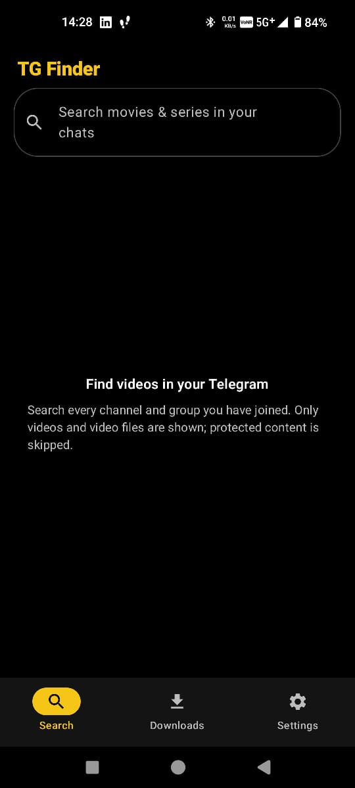
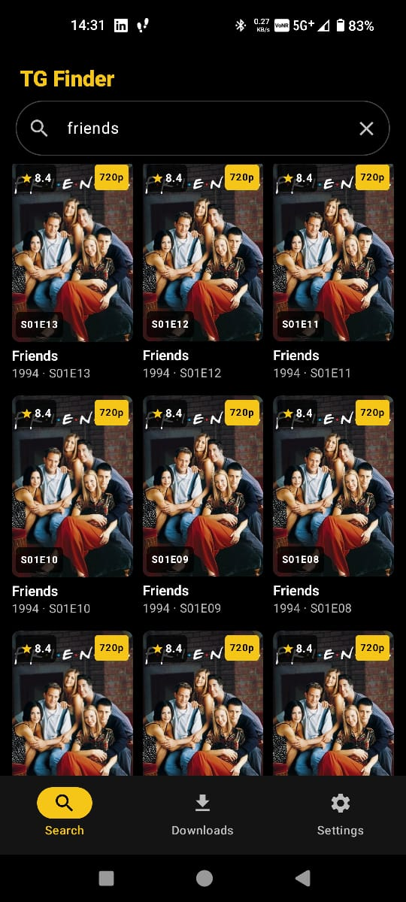
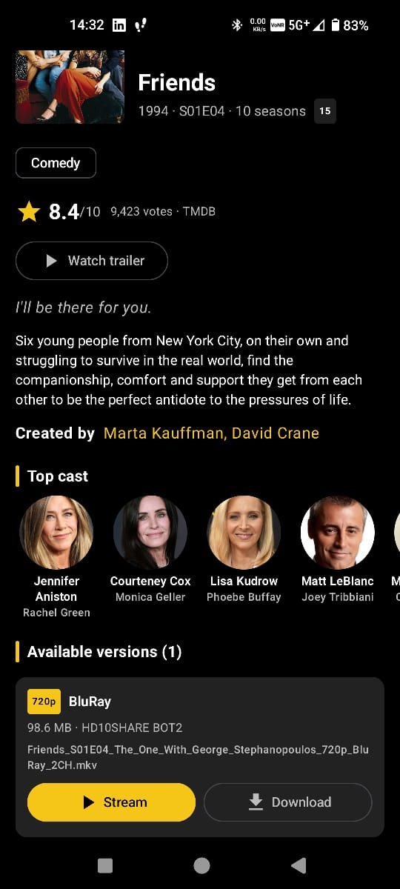
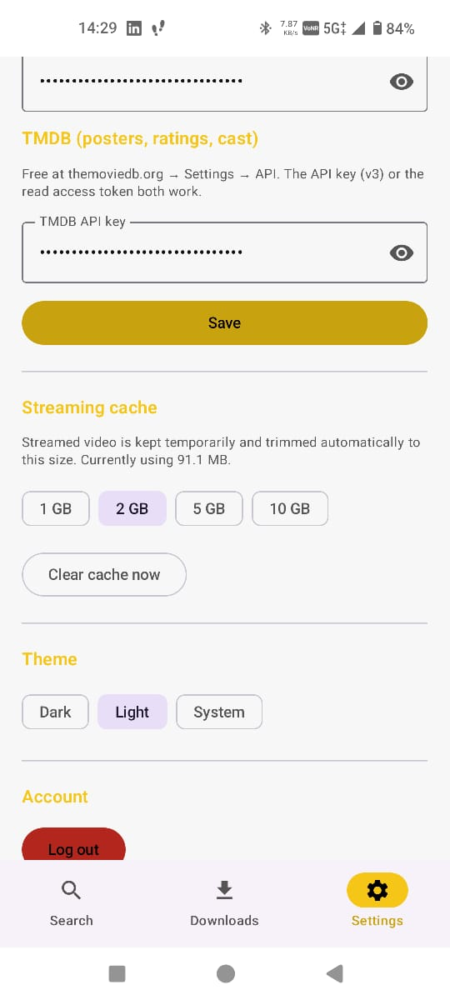

# TG Finder

A personal Android Telegram client that searches **videos** across every channel and group you have
joined, shows them in an IMDb-style poster grid with TMDB metadata, and lets you stream or download
them.

## Screenshots

<table>
  <tr>
    <td align="center"><br/><sub><b>Home</b></sub></td>
    <td align="center"><br/><sub><b>Search results</b></sub></td>
    <td align="center"><br/><sub><b>Title details</b></sub></td>
    <td align="center"><br/><sub><b>Settings (light theme)</b></sub></td>
  </tr>
</table>

- **Search results:** a poster grid with TMDB rating, quality badge and season/episode label.
- **Title details:** rating, plot, creators, top cast, trailer, and each Telegram version with
  **Stream** and **Download** buttons.
- **Settings:** API keys, streaming-cache limit, dark/light/system theme, and logout.

## Tech stack

- Kotlin, Jetpack Compose (Material 3), MVVM
- Official [TDLib](https://github.com/tdlib/td) 1.8.67 (commit `ea97bcd`), built from source for
  `arm64-v8a` and `armeabi-v7a`
- Media3 ExoPlayer, Coil, Room, TMDB API
- minSdk 24 (Android 7.0), targetSdk 37

## What you need before first launch

### 1. Telegram API ID and API hash (required, one time)

1. Open <https://my.telegram.org> (a PC browser works best) and enter your phone number with the
   country code, e.g. `+919876543210`.
2. The login code does **not** come by SMS. It arrives in the Telegram app, in the chat named
   **Telegram** (blue tick). It looks like `aB3xYz9QkLm`: letters and digits, case-sensitive.
   Paste it into the site.
3. Tap **API development tools** and fill in App title `TG Finder`, Short name `tgfinder`,
   Platform **Android**. Leave the URL empty, then tap **Create application**.
   - If the site only says `ERROR`, turn off any VPN or ad-blocker, try another browser, and change
     the short name slightly.
4. At the **top** of the page, under *App configuration*, copy:
   - **App api_id**: a number, which goes into *API ID*
   - **App api_hash**: 32 characters, which goes into *API hash*

   Ignore the MTProto servers, public keys and FCM/WNS sections lower on the page.
5. Keep the api_hash private, like a password.

### 2. TMDB API key (optional: posters, ratings, plot, cast)

1. Create a free account at <https://www.themoviedb.org>.
2. Go to **Settings → API**, request a key (choose *Developer*, personal use), and copy the
   **API Key**. The longer *Read Access Token* also works.

Without a TMDB key, search and playback still work, but results show only Telegram thumbnails and
file names.

The app stores these values encrypted on the phone (EncryptedSharedPreferences). It never logs them.

## Install on your phone

1. Copy `release/TGFinder-1.0.0.apk` to the phone, for example over USB, Google Drive or Telegram
   Saved Messages.
2. On the phone, open the APK from the Files app.
3. If Android blocks it, tap **Settings**, turn on **Allow from this source** for that app, go back
   and tap **Install**.
4. If Play Protect warns about an unknown app, tap **More details → Install anyway**. The app is
   signed with your own local key, so Google doesn't recognise it.
5. Open **TG Finder**.

With USB debugging on, you can install with `adb install release/TGFinder-1.0.0.apk` instead.

## Using the app

1. **Setup:** enter your API ID, API hash and TMDB key, then tap *Save and continue*.
2. **Login:** enter your phone number with the country code, then the code Telegram sends you.
   Enter your two-step verification password if you have one. The session is kept, so you only log
   in once.
3. **Search:** type a title and press search. TG Finder searches every chat you have joined for
   videos and for files whose type is `video/*`. More results load as you scroll.
   - The same title found in several chats or qualities appears as one card with a
     "N versions" badge.
   - Cards show the TMDB poster, year and rating. If TMDB has no match, the card shows the Telegram
     thumbnail and the cleaned file name.
4. **Detail page:** shows the backdrop, poster, runtime, certification, genres, rating, plot,
   director, cast and a trailer button. Under **Available versions**, each version shows its
   quality, size, source chat and duration, with two buttons:
   - **Stream:** plays immediately. Seeking fetches only the needed part of the file.
   - **Download:** saves the file to `Movies/TGFinder`. The download continues with the screen off.
5. **Player:** full-screen landscape. Use the controls to seek (drag the bar, or the ±10 s buttons), change
   playback speed (⚙), and pick the audio track or subtitles. Playback resumes where you left off.
6. **Downloads tab:** shows progress with pause, resume and cancel. Finished videos appear as a
   poster grid: tap to play offline, long-press to delete.
7. **Settings:** change your keys, set the streaming cache limit (1, 2, 5 or 10 GB; default 2 GB),
   clear the cache, switch between dark, light and system themes, or log out.

### What the app does not do

- It skips chats with *protected content* and messages Telegram marks as not savable. It never tries
  to get around these restrictions.
- Secret chats are not searched. TDLib's global search excludes them.
- Playback uses the phone's own decoders. Some files may not play on some phones, for example DTS
  audio or 10-bit HEVC on older devices. If one version fails, try another.
- If Telegram rate-limits searches (flood wait), the app shows a countdown and sends nothing until
  it ends.

## Building the APK yourself

You only need this after changing the code. The ready APK is already in `release/`.

### Easiest: on this PC (Windows)

JDK 17 and the Android SDK are already installed in `C:\Users\<you>\android-dev\`. Open
PowerShell in the `tg-finder` folder and run:

```powershell
powershell -ExecutionPolicy Bypass -File .\build-apk.ps1
```

It runs the tests, builds the signed release APK (about 3–10 minutes), and copies it to
`release\TGFinder-<version>.apk` and to your Downloads folder.

If you install an update over the existing app, bump `versionCode` (and `versionName`) in
`app/build.gradle.kts` first. Android won't install an update with the same or a lower
`versionCode`.

### On a new PC

1. Install **JDK 17** (e.g. Temurin, from <https://adoptium.net>) and **Android Studio** (it
   includes the Android SDK). In Android Studio's SDK Manager, install *Android SDK Platform 37* and
   *Build-Tools 37*.
2. Copy the whole `tg-finder` folder, including `keystore/` and `keystore.properties`.
3. Edit `local.properties` so it points to the SDK, e.g.
   `sdk.dir=C:/Users/<you>/AppData/Local/Android/Sdk`.
4. Set `JAVA_HOME` to the JDK folder, then run `.\gradlew.bat assembleRelease`, or open the
   project in Android Studio and use *Build → Generate Signed App Bundle / APK*.
5. The APK appears at `app\build\outputs\apk\release\app-release.apk`.

### Command line (Git Bash)

```bash
export JAVA_HOME="$USERPROFILE/android-dev/jdk17"
export ANDROID_HOME="$USERPROFILE/android-dev/sdk"
./gradlew testDebugUnitTest   # unit tests (file-name parser, TMDB parsing, error messages)
./gradlew assembleRelease     # signed APK -> app/build/outputs/apk/release/app-release.apk
```

`local.properties` points Gradle at the SDK.

### Release signing

- Keystore: `keystore/tgfinder-release.jks` (alias `tgfinder`)
- Passwords: `keystore.properties` in the project root

Both files are git-ignored. **Back them up.** Future updates must be signed with the same key, or
Android will refuse to install them over the existing app.

### Rebuilding TDLib

Telegram no longer publishes a prebuilt Android TDLib, so the libraries in `app/src/main/jniLibs/`
and the Java sources in `app/src/main/java/org/drinkless/tdlib/` were built with the official
Dockerfile from `td/example/android`. The build was restricted to the two ARM ABIs and used NDK r28
so the arm64 library is 16 KB page-aligned. To rebuild (about 1 hour; needs Docker):

```bash
cd tdlib-build
docker build --build-arg ANDROID_NDK_VERSION=28.2.13676358 \
  --build-arg COMMIT_HASH=<tdlib commit> --output out .
# then unzip out/tdlib.zip and copy tdlib/libs/* -> app/src/main/jniLibs/
#   and tdlib/java/org/drinkless/tdlib/*.java -> app/src/main/java/org/drinkless/tdlib/
```

## Project layout

```text
app/src/main/java/com/tgfinder/
  TgFinderApp.kt            app container (manual DI), Coil setup
  MainActivity.kt           setup / login / main navigation
  data/                     SecurePrefs (encrypted), Room database (TMDB cache, downloads, resume positions)
  telegram/                 TdClient (TDLib wrapper, auth, flood wait), StreamCache, ErrorMessages
  search/                   FileNameParser, VideoSearchSession (search, filtering, grouping)
  tmdb/                     TMDB models and repository (matching + cached details)
  player/                   TelegramDataSource (progressive TDLib streaming), PlayerActivity
  download/                 DownloadRepository, DownloadService (foreground), MediaStoreSaver
  ui/                       Compose screens: search, detail, downloads, settings, login
```

This product uses the TMDB API but is not endorsed or certified by TMDB.
